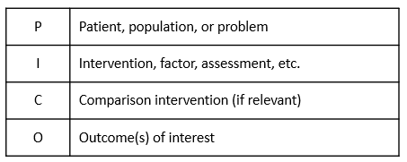
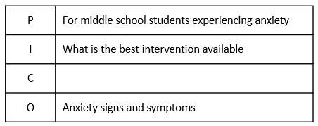

#### Introduction

This document is one of a series designed to illustrate how the R statistical computing environment can be used to conduct various types of social work research. In this report, we present an example of using R and the R *metafor*  package to conduct a meta-analysis of a fictitious set of studies of adolescent anxiety interventions. We caution that we only 'skim the surface' of the topic of meta-analysis. There is a rich array of resources available to researchers who would like to do a meta-analytic study.  

#### The Importance of Thinking About Research in a Larger Context

Like other professions, social work needs a systematic accumulation of evidence about effective practices and interventions. This need spans a wide range of issues and problems with which the profession is concerned. It is the ‘systematic accumulation’ part of the statement that requires constant attention. Meta-analytic thinking is the conceptual framework for developing the this systematic accumulation of evidence. Social work practitioners and researchers alike should be aware of the fact that what they do is a part of larger efforts to accumulate critical knowledge about what constitutes effective practice. 

#### Meta-analysis

Meta-analysis is a set of statistical tools that facilitates 'studies of studies', and the building of accessible articles and sites where social work practitioners can find helpful resources to inform their practice (e.g., like the Campbell Collaboration and Cochrane Collaboration).

In many ways, meta-analysis is the backbone of meta-analytic thinking. It is the formal activity that produces statistical summaries of common-focus studies which make critical information about program or intervention effectiveness (through effect sizes) and the precision of results (through confidence intervals) available to practitioners. A well-done meta-analysis focusing on a problem or issue facing a practicing social worker can be indispensable in informing a decision about possible effective interventions.

Where meta-analyses fit in our practice:

 * A meta-analysis can be an important resource in helping locating effect size estimates for a power analysis
 * Meta-analyses can be useful in locating potential evidence-programs and interventions
 * Meta-analyses help a social work researcher understand where his or her research fits in the larger body of research about a topic
 
While there are numerous conceptualizations of the meta-analysis process, the following steps are generally recommended:

 1. An answerable question is framed that elaborates the relationship of interest.
 2. A comprehensive literature search is conducted to identify studies that provide data relevant to the answerable question.
 3. Studies are reviewed for quality and those studies deemed to be acceptable are coded so that an effect size can be computed.
 4. A meta-analysis is performed using various statistical and graphical methods.
 5. Results are interpreted and reported.
 
#### A Case Study

Say you are a social work researcher and have been contacted by a local middle school to assist in developing a program to address what school social workers have determined to be an emerging and significant problem area. Specifically, the social workers have seen a dramatic increase in students exhibiting anxiety that seems to be related to the unsettling impacts of Covid-19 pandemic on the educational experience. The problem recently has increased with the transition from virtual education back to face-to-face instruction. Staff has asked that you assist in identifying potential evidence-based interventions for adolescent anxiety and to collaborate on a pilot anxiety intervention study in the school.  

Based on your training in evidence-based social work practice at the OSU College of Social Work, you set up a comprehensive approach to identify potentially effective interventions by adding your own meta-analysis study using the steps discussed above.

#### Step 1: The answerable question

Framing the answerable question can be done in a number of ways. In the evidence-based practice framework, a PICO statement is recommended. PICO is an acronym for problem, intervention, comparison, and outcome. It is best illustrated in a table format:



You use the PICO framework for your answerable question as follows:



Stated another way, your answerable question is "For middle school students experiencing anxiety, what is the best intervention available that has a high probability of decreasing signs and symptoms of anxiety". 

#### Step 2: Comprehensive literature search

Based on your answerable question, you conduct a comprehensive search of interventions designed to address adolescent anxiety. You find a number of systematic reviews and meta-analyses, but determine that these studies do not include more recent adolescent anxiety intervention research (this is frequently a problem where the meta-analysis literature may lag by three years or more). In the process, you discover that recent studies have been reported in individual articles but have not been included in a meta-analysis. You decide to do your own.

#### Step 3: Study review and coding

You identify six adolescent anxiety intervention studies completed and reported in the past three years (since 2018) that appear to be relevant to your needs. You carefully review each study for quality using the GRADE framework and determine that all studies are of high quality. All studies were randomized controlled trials; some were conducted in school settings and others were conducted in community mental health settings. Interventions were based on cognitive behavioral methods or mindfulness methods, or in one study, a combination. 

In all studies, outcomes were measured on a continuous scale using various adolescent anxiety scales (e.g.,Revised Children's Manifest Anxiety Scale ((RCMAS), the Screen for Child Anxiety Related Emotional Disorders (SCARED), and the Spence Children's Anxiety Scale (SCAS). Because of the different metrics for these scales, you decide to use a standardized mean difference as the effect size for the meta-analysis. Each study had all the important data for effect size calculations (Ns, means, standard deviations). You coded that information in the appropriate format for  *metafor* and load it into R.

```{r,include=FALSE }
data.smd.1 <- read.csv("meta_smd.csv", header = TRUE, sep=",")
```

```{r setup, include=FALSE}
knitr::opts_chunk$set(echo = TRUE)
```

#### Step 4: Conduct meta-analysis

First, you load the *metafor* library:

```{r message=FALSE, warning=FALSE}
library(metafor)
library(dplyr) 
library(tidyr)
library(knitr)
```

Next, you calculate an estimated standardized mean difference (SMD) effect size and standard error (SE) for each study. Various statistics are shown in the following data frame -- the yi column is the standardized mean difference value (Hedge's g) and the vi column is the sampling variance of that estimate. 

```{r}
smd1 <- escalc(n1i = n_tx, n2i = n_cont, m1i = m_tx, m2i = m_cont, 
              sd1i = sd_tx, sd2i = sd_cont, data = data.smd.1, measure = "SMD", 
              append = TRUE)
print(smd1)
smd1 %>% 
    select(Author=author, Year=year, "Program Mean"=m_tx, "Control Mean"=m_cont, SMD=yi) %>% 
    kable(digits = 3, format="pandoc", caption="")

```

Study SMD estimates ranged from a low of .28 for the Franks study to a high .64 for the Jeffers study. These values can be interpreted in the Cohen SMD framework where an SMD = .20 is a low effect size, SMD = .50 is a medium of moderate effect size, and an SMD = .80 is a large effect size. These studies show a low to medium range of effect sizes. Note: Cohen and others caution that using this framework in a rigid way can be problematic -- what is a low effect size in one study context can be a moderate or even high effect size in another study context. 

A meta-analysis goal is to calculate an overall or summary effect size which serves an indicator about how the studies, as a whole, reflect intervention effects. Two models can be considered - a fixed effects model or a random effect model. In this analysis, given that the studies are very similar in focus and intent, you choose a fixed effects model which addresses the question: How large is the average true effect in our set of studies? You use a weighted least squares estimation method which applies a weighting process to reflect the differences in study sizes and variance estimates. In addition, you are interested in the extent to which the studies are statistically similar  which is also an important consideration the the computation of the summary effect size. Wide variability in studies (heterogeneity) effects summary effect size precision.

You run the models as follows:     

```{r}
res1 <- rma(yi, vi, data = smd1, method = "FE")
print(res1)
```

One way of assessing whether there is heterogeneity in a meta-analysis is to use the Cochrane's Q test. The Q test is computed by summing the squared deviations of each study’s effect estimate from the overall effect estimate, weighting the contribution of each study by its inverse variance. Under the hypothesis of homogeneity among the effect sizes, the Q statistic follows a chi-square distribution with k – 1 degrees of freedom, k being the number of studies. Not rejecting the homogeneity hypothesis usually leads the meta-analyst to adopt a fixed-effects model because it is assumed that the estimated effect sizes only differ by sampling error. For your study, the chi-square p-value = .76 was not significant, thus the assumption of the homogeneity of your studies was plausible and a fixed effects model was appropriate. 

The weighted least square summary effect size estimate for your set of studies was .49. This coefficient can be interpreted as the weighted average of the individual study standardized means differences, and thus also can be interpreted as a standardized mean difference. You conclude that the overall picture of your studies is that cognitive behavioral interventions and/or mindfulness based interventions produce, on the average, a moderate/medium difference between an intervention group and a control condition.

While there is some variability in how effect size data is presented and analyzed in a meta-analysis, effect sizes often are reported in graphs called forest plots (see Forest Plot 1 below). The major features of a forest plot are as follows:

 * Each line represents one study. 
 * The boxes represent the location of the effect size on the effect size scale. Their distance away from the no difference or no effect perpendicular line indicates how big the effect size is – the further away it is the larger the effect size. The size of the box is an indicator of how the precision of the estimate -- larger boxes equal more precise estimates.
 * The diamond represents that summary effect size.
 * The whiskers on either side of the effect size boxes are confidence intervals. They are indicators of the precision of the effect size estimate in a study. Narrow confidence intervals are better than wide confidence intervals – they indicate a more precise estimate.
 * If either tail of a confidence interval crosses the no difference or no effect line, it indicates that that study was not statistically significant. Two studies in the diagram -- Franks and Bigelow -- are not significant.

```{r, echo=FALSE}
forest(res1, slab = paste(smd1$author, as.character(smd1$year), sep =", "),
       cex=1, header=TRUE, showweights = TRUE, top = 2, main = "Forest Plot 1" )
```

Forest plots are particularly helpful to practitioners. For example, a school social worker looking for an evidence -based intervention using this meta-analysis would likely be interested in Jeffers study due to its large effect size as indicated by the distance between the no effect perpendicular line and the effect size rectangle. Actually, the Behling, Rose, Jeffers, and Andrews studies all would potentially be quite helpful due to their medium and above effect size magnitudes. 

A second key question in a meta-analysis is concerned with publication bias. A comprehensive meta-analysis should include an accurate representation of a set of studies. Publication bias can seriously compromise conclusions reached. A funnel plot is a graph designed to check for the existence of publication bias. In the absence of publication bias, it assumes that studies with high precision will be plotted near the average, and studies with low precision will be spread evenly on both sides of the average, creating a roughly funnel-shaped distribution. Deviation from this shape can indicate publication bias.

A funnel plot is a scatterplot of treatment effect against a measure of study precision. It is used primarily as a visual aid for detecting bias or systematic heterogeneity. A symmetric inverted funnel shape arises from a ‘well-behaved’ data set, in which publication bias is unlikely. An asymmetric funnel indicates a relationship between treatment effect estimate and study precision. This suggests the possibility of either publication bias or a systematic difference between studies of higher and lower precision (typically ‘small study effects’). Asymmetry can also arise from use of an inappropriate effect measure. Whatever the cause, an asymmetric funnel plot leads to doubts over the appropriateness of a simple meta-analysis and suggests that there needs to be investigation of possible causes. (From Wikipedia).

The funnel plot for your meta-analysis is shown below (Funnel Plot 1).

```{r, echo=FALSE}
funnel(res1, main="Funnel Plot 1")
```

Funnel plots typically are more helpful for discerning publication bias when there are many studies in the meta-analysis. Your funnel plot does not show evidence of publication bias -- all studies fall within the 'funnel'.  

#### Step 5: Results are interpreted and reported

Typically, the next step in the process is to develop a summary of your findings. In this case, however, your plan was to use the meta-analysis results to develop and evaluate an intervention for the school. (Note: For guidance about how to use R in planning and analyzing an intervention study see: https://rpubs.com/JBean/722296)

Your meta-analysis results helped in two ways. First, you used the summary effect size as an estimate of the expected population effect size in a power analysis. Second, you used the effect sizes of studies in your meta-analysis to guide your selection of a high-probability of success anxiety intervention. The following are highlights of your intervention planning and implementation:

 * School leadership gave you permission to develop a randomized controlled trial knowing the important stakes of the study.
 * Your power analysis indicated that for a study to detect a medium sized standardized mean difference (SMD = .49 from your study), with alpha set to .05, and expected power to be .80, you needed to have 64 students in each group in the study (treatment and control).
 * The Jeffers study (SMD = .64 from your study) used a combined CBT and mindfulness intervention (MCBT) that was appropriate for both groups and individuals. It has a well-designed manual containing details about how the intervention is implemented.
 * You developed a structure implementation plan and provided the 12-session intervention to the treatment group.
 * A the end of the sessions, you administered the recommended Spence Children's Anxiety Scale (SCAS) to both the treatment and the control group.
 * The primary statistical test you used was an independent samples t-test with a standardize mean difference effect size (Hedge's g). Results from your study were statistically significant (p <= .001) and practically significant Hedge's g = .67.
 
With your newly developed skills, you decide to expand your meta-analysis by including the study you just completed.  You know that social work needs on-going attention to the systematic accumulation of evidence about effective practices and interventions, and this is an opportunity to add to the knowledge of effective adolescent anxiety interventions. You also know that it is possible to disseminate your findings in non-traditional ways by using report developing and publishing capacities of R and RStudio.   

You repeat the meta-analysis process with your study included. First, you compute the effect size estimates (yi) and estimate variances (vi). 

```{r, echo=FALSE}
#Read Data
data.smd.2 <- read.csv("meta_smd_2.csv", header = TRUE, sep=",")
smd2 <- escalc(n1i = n_tx, n2i = n_cont, m1i = m_tx, m2i = m_cont, 
              sd1i = sd_tx, sd2i = sd_cont, data = data.smd.2, measure = "SMD", 
              append = TRUE)
print(smd2)
```

Next, you fit a fixed effects model. Cochrane's Q test of homogeneity is not significant indicating that the assumption of the homogeneity of your studies was plausible and a fixed effects model was appropriate. Further, the weighted least square summary effect size estimate for this set of studies was .52, an increase over the .49 estimate with the original siz studies. 

```{r echo=FALSE}
res2 <- rma(yi, vi, data = smd2, method = "FE")
## Print Results
print(res2)
```

The forest plot for the expanded analysis nicley illustrates how your study fits into the meta-analysis. 

```{r, echo=FALSE}
forest(res2, slab = paste(smd2$author, as.character(smd2$year), sep =", "),
       cex=1, header=TRUE, showweights = TRUE, top = 1, main = "Forest Plot 2")
```

Ditto for the funnel plot -- your studies do not show evidence of publication bias.

```{r, echo=FALSE}
funnel(res2, main="Funnel Plot 2")
```

#### Step 6: Conclusions and wrap-up

You prepared a report to the school detailing your work and results. Because your findings were consistent with the Jeffers findings, you concluded there was growing evidence about the efficacy of MCBT interventions for adolescent anxiety. Therefore, your recommendation to the school was that the MCBT intervention should be adopted and made fully available to staff and students. In addition, you prepared a detailed report using R and RMarkdown, published that report to RPubs, and provided the link to interested colleagues. Finally, you prepared an article for the *Journal of Evidence-based Social Work* (or another social work journal) to ensure a broader dissemination of your findings.

#### Final note from JB

I prepared this vignette out of a conviction that meta-analytic thinking and meta-analysis studies are fundamentally important to the social work profession -- especially in the framework of evidence-based practice. They are important in two ways. First, all social work practitioners should be versed **in how to think meta-analytically** and to have **skills in reading and interpreting meta-analysis studies**. The ability to **understand forest plots** may be the most important of the skill-set. Second, social work researchers should have exposure to **meta-analysis methods and programs** and should be equipped to conduct a meta-analysis as the need arises. Not all studies have to be extensive -- the example in this vignette could be quite realistic for a social work researcher. Further, the tools for conducting meta-analysis studies are readily available in the R statistical computing environment. As illustrated above, *metafor* is versatile and comprehensive. Above all, R and R packages are free.

#### References

Bornstein, M. et al. (2009). *Introduction to Meta-Analysis*. New York, NY: Wiley.

Basu, Arindam. (2017). How to conduct a meta-analysis: A basic tutorial. Retrieved from https://peerj.com/preprints/2978/.

Viechtbauer, W. (2010). Conducting meta-analyses in R with the metafor package. *Journal of
Statistical Software*, 36(3), 1–48. https://www.jstatsoft.org/v036/i03.

